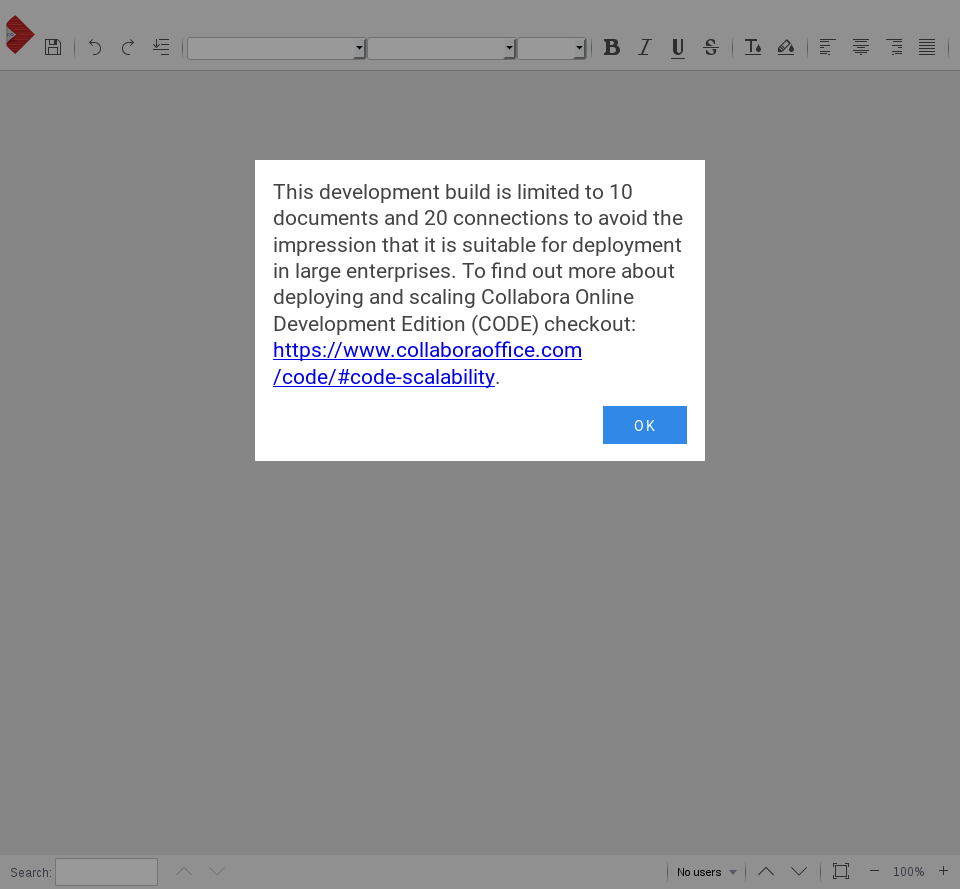
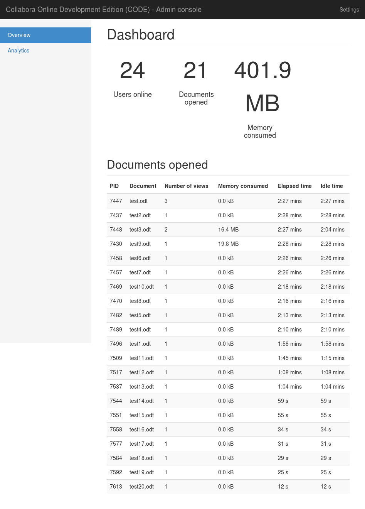

This project compiles and build a `loolwsd.rpm` package based on the spec of the official Collabore `loolwsd` spec (which was extracted using rpmrebuild).

The aim is to remove the 10 documents limit, by recompiling:






#Generate spec file from existing rpm:
```
rpmrebuild -s --package --notest-install -e loolwsd-2.1.2-6.el7.centos.x86_64.rpm
```

(ref https://stackoverflow.com/questions/5613954/extract-the-spec-file-from-rpm-package)

# Manual build
1. Install Requirements
Centos packages:
```
libpng-devel
libcap-devel
cppunit-devel
poco-devel
npm
pcre-devel
openssl-devel
python-polib
epel-release # for nodejs
nodejs
```
and npm package:
```
sudo npm install -g jake
```

2. built

```
./autogen.sh
./configure --with-max-documents=10000 --with-max-connections=10000 --with-lokit-path=bundled/include
sudo make install
```
